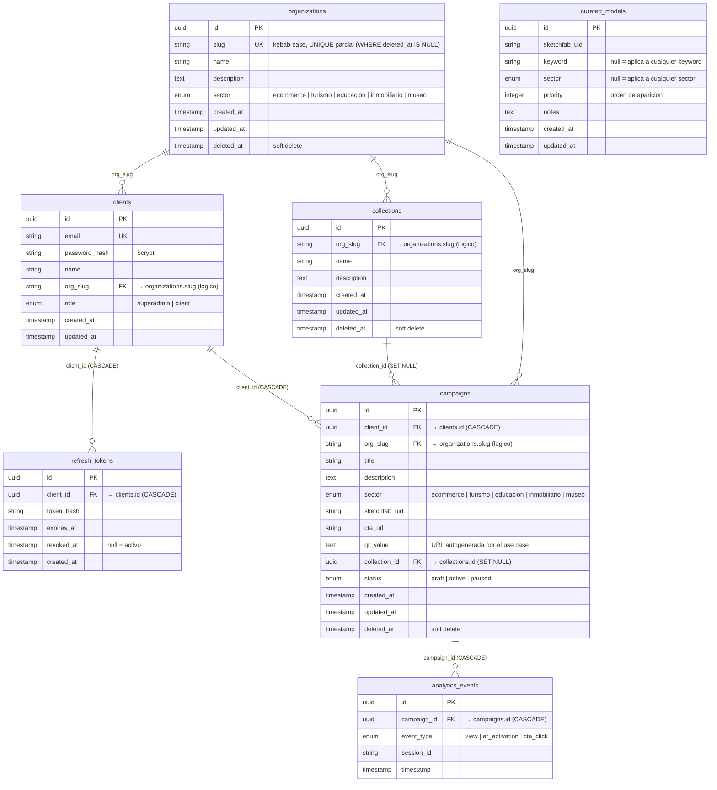

# DER — modelar-core

> Diagrama Entidad-Relación y descripción de tablas del servicio `modelar-core`. Fuente de verdad para la sección "Base de Datos" del Manual Técnico.
>
> Schema vivo en Postgres 16. Todas las tablas usan **soft delete** (columna `deleted_at` nullable) excepto `refresh_tokens` (revocación con `revoked_at`) y `analytics_events` (eventos inmutables).

---

## Diagrama (Mermaid ER)



> `curated_models` no tiene FK con ninguna otra tabla: son recomendaciones independientes que el `SearchModelsUseCase` mergea en los resultados de Sketchfab.

---

## Descripción de tablas

### `organizations`

Cliente del SaaS (museo, editorial, retailer, etc.). El `slug` es el identificador estable usado por el resto del dominio para asociar recursos.

| Campo                      | Tipo      | Constraint     | Descripción                                                                                                                                             |
| -------------------------- | --------- | -------------- | ------------------------------------------------------------------------------------------------------------------------------------------------------- |
| `id`                       | UUID      | PK             | Clave primaria interna                                                                                                                                  |
| `slug`                     | STRING    | UNIQUE parcial | kebab-case (`^[a-z0-9]+(-[a-z0-9]+)*$`). La UNIQUE aplica solo a filas vivas (`WHERE deleted_at IS NULL`), permite reciclar el slug tras un soft delete |
| `name`                     | STRING    | NOT NULL       | Display name                                                                                                                                            |
| `description`              | TEXT      | NULL           | Descripción libre                                                                                                                                       |
| `sector`                   | ENUM      | NOT NULL       | `ecommerce \| turismo \| educacion \| inmobiliario \| museo`. Determina labels de UI (Serie/Categoría/Sala/Proyecto/Destino)                            |
| `created_at`, `updated_at` | TIMESTAMP | NOT NULL       | Auditoría                                                                                                                                               |
| `deleted_at`               | TIMESTAMP | NULL           | Soft delete (paranoid)                                                                                                                                  |

**Índices:** `sector`.

### `clients`

Usuario administrador. Pertenece a una organización vía `org_slug`.

| Campo                      | Tipo      | Constraint      | Descripción                                                                                              |
| -------------------------- | --------- | --------------- | -------------------------------------------------------------------------------------------------------- |
| `id`                       | UUID      | PK              |                                                                                                          |
| `email`                    | STRING    | UNIQUE NOT NULL | Identificador de login                                                                                   |
| `password_hash`            | STRING    | NOT NULL        | Hash bcrypt (cost 10)                                                                                    |
| `name`                     | STRING    | NOT NULL        | Nombre del usuario                                                                                       |
| `org_slug`                 | STRING    | NOT NULL        | Asociación lógica con `organizations.slug` (sin FK formal en DB para mantener flexibilidad multi-tenant) |
| `role`                     | ENUM      | NOT NULL        | `superadmin \| client`. SUPERADMIN gestiona el SaaS; CLIENT es el admin de la org                        |
| `created_at`, `updated_at` | TIMESTAMP | NOT NULL        |                                                                                                          |

**Índices:** `email` (UNIQUE), `org_slug`.

> No tiene soft delete: si un cliente se "elimina", se hace por bloqueo a nivel de Auth (no implementado todavía).

### `refresh_tokens`

Tokens de refresco emitidos en cada login. Rotación atómica: cada `POST /api/auth/refresh` revoca el anterior y emite uno nuevo dentro de la misma transacción.

| Campo        | Tipo      | Constraint                              | Descripción                                          |
| ------------ | --------- | --------------------------------------- | ---------------------------------------------------- |
| `id`         | UUID      | PK                                      |                                                      |
| `client_id`  | UUID      | **FK → `clients.id` ON DELETE CASCADE** | Si borrás un cliente, sus refresh tokens caen con él |
| `token_hash` | STRING    | NOT NULL                                | SHA-256 del refresh token (no se guarda en plano)    |
| `expires_at` | TIMESTAMP | NOT NULL                                | TTL del refresh (7 días por default)                 |
| `revoked_at` | TIMESTAMP | NULL                                    | `NULL` = activo · valor = revocado en esa fecha      |
| `created_at` | TIMESTAMP | NOT NULL                                |                                                      |

**Índices:** `client_id`.

**Operación crítica:** `revokeIfActive` ejecuta `UPDATE … SET revoked_at = NOW() WHERE id = ? AND revoked_at IS NULL` para garantizar atomicidad ante refresh paralelos.

### `collections`

Agrupación lógica de campañas dentro de una organización. Compartida por todos los clientes de la misma org.

| Campo                      | Tipo      | Constraint | Descripción                                          |
| -------------------------- | --------- | ---------- | ---------------------------------------------------- |
| `id`                       | UUID      | PK         |                                                      |
| `org_slug`                 | STRING    | NOT NULL   | Tenant key. Todas las queries filtran por este campo |
| `name`                     | STRING    | NOT NULL   | Nombre de la colección                               |
| `description`              | TEXT      | NULL       | Opcional                                             |
| `created_at`, `updated_at` | TIMESTAMP | NOT NULL   |                                                      |
| `deleted_at`               | TIMESTAMP | NULL       | Soft delete (paranoid)                               |

**Índices:** `org_slug`.

### `campaigns`

Campaña AR — el recurso central del producto. Cada campaña es propiedad de un cliente y opcionalmente pertenece a una colección.

| Campo                      | Tipo      | Constraint                                   | Descripción                                                                                             |
| -------------------------- | --------- | -------------------------------------------- | ------------------------------------------------------------------------------------------------------- |
| `id`                       | UUID      | PK                                           |                                                                                                         |
| `client_id`                | UUID      | **FK → `clients.id` ON DELETE CASCADE**      | Dueño de la campaña                                                                                     |
| `org_slug`                 | STRING    | NOT NULL                                     | Tenant key (denormalizado para queries multi-tenant rápidas)                                            |
| `title`                    | STRING    | NOT NULL                                     | Título visible                                                                                          |
| `description`              | TEXT      | NULL                                         |                                                                                                         |
| `sector`                   | ENUM      | NOT NULL                                     | Mismo enum que `organizations.sector`                                                                   |
| `sketchfab_uid`            | STRING    | NOT NULL                                     | UID del modelo 3D en Sketchfab                                                                          |
| `cta_url`                  | STRING    | NULL                                         | URL del CTA en el viewer AR (opcional)                                                                  |
| `qr_value`                 | TEXT      | NOT NULL                                     | URL autogenerada (`{FRONTEND_URL}/#/ar/{sketchfab_uid}`). El frontend escanea el QR y resuelve esta URL |
| `collection_id`            | UUID      | **FK → `collections.id` ON DELETE SET NULL** | Opcional. Si la colección se borra, el campo queda NULL (la campaña sobrevive)                          |
| `status`                   | ENUM      | NOT NULL DEFAULT 'draft'                     | `draft` (no resuelve público) · `active` (operativa) · `paused` (resuelve con 423/410)                  |
| `created_at`, `updated_at` | TIMESTAMP | NOT NULL                                     |                                                                                                         |
| `deleted_at`               | TIMESTAMP | NULL                                         | Soft delete (paranoid)                                                                                  |

**Índices:** `client_id`, `org_slug`, `collection_id`, `sector`.

### `analytics_events`

Eventos disparados por el AR viewer público. Inmutables — sin updates ni delete; el `BatchBufferService` los inserta en lotes para reducir presión I/O.

| Campo         | Tipo      | Constraint                                | Descripción                                                                                |
| ------------- | --------- | ----------------------------------------- | ------------------------------------------------------------------------------------------ |
| `id`          | UUID      | PK                                        |                                                                                            |
| `campaign_id` | UUID      | **FK → `campaigns.id` ON DELETE CASCADE** | Campaña que originó el evento                                                              |
| `event_type`  | ENUM      | NOT NULL                                  | `view` (carga del viewer) · `ar_activation` (entró a modo AR) · `cta_click` (click en CTA) |
| `session_id`  | STRING    | NULL                                      | ID anónimo del navegador para deduplicar visitas                                           |
| `timestamp`   | TIMESTAMP | NOT NULL                                  | Cuándo ocurrió el evento (no `created_at` — se mide en el cliente)                         |

**Índices:** `campaign_id`, `event_type`, `timestamp`.

### `curated_models`

Recomendaciones manuales de SUPERADMIN. El `SearchModelsUseCase` las inyecta al principio de los resultados de Sketchfab (deduplicadas por UID).

| Campo                      | Tipo      | Constraint         | Descripción                                                                                                         |
| -------------------------- | --------- | ------------------ | ------------------------------------------------------------------------------------------------------------------- |
| `id`                       | UUID      | PK                 |                                                                                                                     |
| `sketchfab_uid`            | STRING    | NOT NULL           | UID del modelo 3D en Sketchfab                                                                                      |
| `keyword`                  | STRING    | NULL               | Si `NULL`, aplica a cualquier búsqueda. Si tiene valor, solo aparece cuando el query lo contiene (case-insensitive) |
| `sector`                   | ENUM      | NULL               | Si `NULL`, aplica a cualquier sector. Si tiene valor, solo aparece para ese sector                                  |
| `priority`                 | INTEGER   | NOT NULL DEFAULT 0 | Orden ascendente                                                                                                    |
| `notes`                    | TEXT      | NULL               | Notas internas del admin                                                                                            |
| `created_at`, `updated_at` | TIMESTAMP | NOT NULL           |                                                                                                                     |

**Índices:** `sketchfab_uid`, `sector`.

---

## Resumen de relaciones

| De                             | Tabla A         | Cardinalidad | Tabla B            | Política            | Notas                                                                          |
| ------------------------------ | --------------- | ------------ | ------------------ | ------------------- | ------------------------------------------------------------------------------ |
| Organización tiene clientes    | `organizations` | 1 — N        | `clients`          | `org_slug` (lógica) | No hay FK formal en DB; multi-tenancy a nivel aplicación                       |
| Organización tiene colecciones | `organizations` | 1 — N        | `collections`      | `org_slug` (lógica) | Idem                                                                           |
| Organización tiene campañas    | `organizations` | 1 — N        | `campaigns`        | `org_slug` (lógica) | Idem (denormalizado por performance)                                           |
| Cliente tiene refresh tokens   | `clients`       | 1 — N        | `refresh_tokens`   | FK CASCADE          | Borrar el cliente revoca todos sus refreshes                                   |
| Cliente tiene campañas         | `clients`       | 1 — N        | `campaigns`        | FK CASCADE          | Borrar el cliente borra sus campañas                                           |
| Colección agrupa campañas      | `collections`   | 1 — N        | `campaigns`        | FK SET NULL         | Borrar la colección NO borra las campañas; el FK queda NULL                    |
| Campaña genera eventos         | `campaigns`     | 1 — N        | `analytics_events` | FK CASCADE          | Borrar la campaña borra sus eventos (campaña ya soft-deleted no recibe nuevos) |

### Por qué algunas FKs son lógicas y otras formales

- **Formales** (`client_id`, `collection_id`, `campaign_id`): el dominio garantiza que borrar el padre afecta al hijo. La DB lo enforza vía CASCADE / SET NULL.
- **Lógicas** (`org_slug` en `clients`, `collections`, `campaigns`): la organización es un recurso de granularidad mayor; cambiar su `slug` no debería propagar (de hecho el `slug` es inmutable por diseño del `UpdateOrganizationDto`). Si una org se borra, sus clientes, colecciones y campañas quedan "huérfanos" intencionalmente — el operador resuelve manualmente (decisión documentada en `SoftDeleteOrganizationUseCase`).

---

## Backup y restauración

```bash
# Backup
docker exec modelar-postgres pg_dump -U postgres modelar_db > backup.sql

# Restauración
docker exec -i modelar-postgres psql -U postgres -d modelar_db < backup.sql
```

## Re-crear el schema desde cero

```bash
# En modelar-core
docker compose up -d postgres redis      # levanta Postgres 16 (5433) y Redis 7 (6380)
pnpm db:migrate                            # corre las migrations 01..07
pnpm db:seed                               # 4 clientes seed (1 superadmin + 3 client) y 4 organizations
```

Las 7 migrations existentes:

| Archivo                         | Crea                                                |
| ------------------------------- | --------------------------------------------------- |
| `01-create-clients.ts`          | tabla `clients` + índices                           |
| `02-create-refresh-tokens.ts`   | tabla `refresh_tokens` + FK CASCADE a `clients`     |
| `03-create-collections.ts`      | tabla `collections` + índice por `org_slug`         |
| `04-create-campaigns.ts`        | tabla `campaigns` + FKs CASCADE/SET NULL            |
| `05-create-analytics-events.ts` | tabla `analytics_events` + FK CASCADE               |
| `06-create-curated-models.ts`   | tabla `curated_models`                              |
| `07-create-organizations.ts`    | tabla `organizations` + UNIQUE parcial sobre `slug` |
